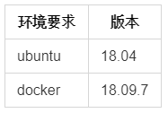
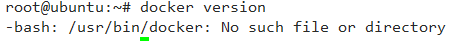
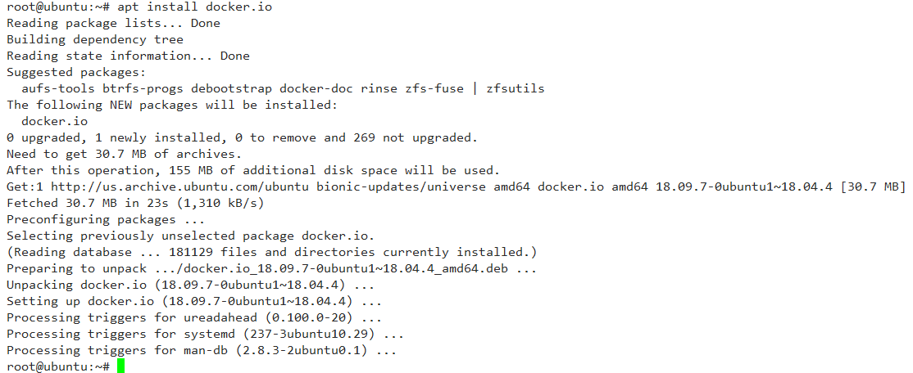
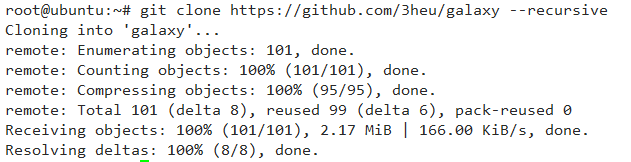
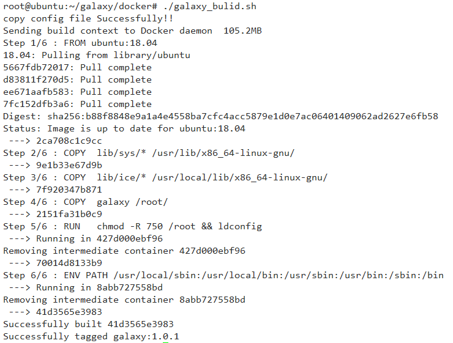
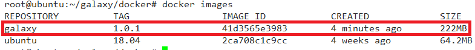

##  galaxy镜像编译操作指南
引言
&emsp;&emsp;这篇文章主要目是对galaxy公链的docker制作镜像提供指导，实现docker镜像自动编译。

申明
- 本文的演示实例都是在ubuntu 18.04环境进行操作的。
- 文章中所有在linux下命令行操作都是以root用户进行运行的，请注意在命令操作过程需要谨慎，防止root用户操作不当引起系统故障。
- 建议读者使用要求docker的最新版本，防止操作过程中docker版本过低引起运行故障。

**安装docker**

galaxy的运行环境与最低版本要求



galaxy的运行程序目前是在docker中运行的，因此要部署galaxy需要在环境中部署先安装docker
以root用户登录ubuntu系统后台，执行如下命令查看docker是否安装。
```CQL
docker version
```


如果查不到docker版本信息，请使用下面命令进行安装，如果已经安装了docker则跳过该步骤。
```CQL
apt install docker.io
```


**镜像编译**
通过git下载galaxy的程序包
```CQL
git clone https://github.com/3heu/galaxy --recursive
```


切换到程序包的docker路径，执行shell命令编译镜像
 ```CQL
 cd galaxy/docker
 ./galaxy_bulid.sh 
 ```


**查看镜像**
```CQL
docker images
```



能够查到镜像galaxy:1.0.1, 说明galaxy镜像已经生成。

 