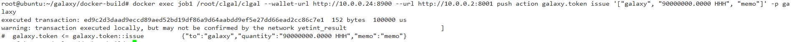

##  galaxy单节点部署操作指南
### 1 引言
&emsp;&emsp;galaxy公链发布了，写这篇文章主要目的是对galaxy公链的单节点部署与运行提供基本的操作指导，包括节点的部署、合约的加载与合约的执行等，使读者能够更好的了解galaxy的特点，熟悉galaxy相关操作。

### 2 节点的部署
#### 2.1 部署前提
&emsp;&emsp;galaxy的运行程序目前是在docker中运行的，因此要部署galaxy需要在环境中部署先安装docker，只有安装了docker才能部署galaxy，至于docker的安装请参考相关的安装说明。

**galaxy的运行环境与最低版本要求**
| 环境要求   | 版本                                 | 
| ------ | ------------------------------------------ | 
| ubuntu | 18.04 |
| docker | 18.09.7 |

**节点信息**
| 节点   | 公钥                                 | 私钥 | 对外端口 |
| ------ | ------------------------------------------ | --------------- |-----|
| 创世节点(galaxy) | GAL6MRyAjQq8ud7hVNYcfnVPJqcVpscN5So8BhtHuGYqET5GDW5CV | 5KQwrPbwdL6PhXujxW37FSSQZ1JiwsST4cqQzDeyXtP79zkvFD3 |8900 |

#### 2.2 单节点部署
**加载镜像**
将docker的镜像包galaxy_image.tar.gz，上传到linux系统固定的目录下，通过如下命令将docker镜像导入到环境中
```CQL
docker load -i galaxy_image.tar.gz
```


创建docker网络名称为gal_net
```CQL
docker network create --driver bridge --subnet=10.0.0.0/24 --gateway 10.0.0.1 gal_net
```


**启动node节点**
```CQL
docker run --name job1 -v /root/galaxy/data/job1:/root/data/job1 -v /root/galaxy/data/logs:/root/data/logs -d -p 8001:8001 --ip 10.0.0.2 --network gal_net -it galaxy:1.0.1 /bin/bash -c \
"/root/startscript/start_nodgal1.sh"
```


参数说明
| 参数   | 说明                                 |
| ------ | ------------------------------------------ |
|job1 |docker的容器名称 |
|/root/galaxy/data/job1| node数据映射到docker容器外部的路径，用户可以指定自己环境的实际路径|
|/root/data/job1| docker容器内部保存node数据的路径|
|/root/galaxy/data/logs| 合约数据映射到docker容器外部的路径，用户可以指定自己环境的实际路径|
|/root/data/logs| docker容器内部保存合约数据的路径|
|8001:8001| docker端口映射将内部8001端口映射到外部8001端口|
|10.0.0.2| docker分配的内部IP地址|
|gal_net| docker分配的网络名称|
|galaxy:1.0.1|docker运行使用的镜像|
|/root/startscript/start_nodgal1.sh|docker启动加载的启动脚本|

通过命令查看node信息
```CQL
docker logs -f job1
```

发现节点已经正常出块


**注意**：docker logs命令在屏幕上持续的打印出块日志，可以通过ctrl+z命令退出

**启动钱包**
```CQL
docker run \
      --name kgald  -v /root/galaxy/data/galaxy-wallet:/root/galaxy-wallet -d -p 8900:8900 \
      --ip 10.0.0.24 \
      --network gal_net \
      galaxy:1.0.1 /bin/bash -c \
      "./root/kgald/kgald \
      --http-server-address=10.0.0.24:8900 \
      --access-control-allow-origin=* \
      --http-validate-host=false"
```


参数说明
| 参数   | 说明                                 |
| ------ | ------------------------------------------ |
|kgald |docker的容器名称 |
|/root/galaxy/data/galaxy-wallet| 钱包数据映射到docker容器外部的路径，用户可以指定自己环境的实际路径|
|/root/galaxy-wallet| docker容器内部保存钱包数据的路径|
|8900:8900| docker端口映射将内部8900端口映射到外部8900端口|
|10.0.0.24| docker分配的内部IP地址|
|gal_net| docker分配的网络名称|
|galaxy:1.0.1|docker运行使用的镜像|
|/root/kgald/kgald|docker启动加载的启动命令|

### 3 操作命令
#### 3.1 钱包操作

创建默认钱包
```CQL
docker exec job1 /root/clgal/clgal --wallet-url http://10.0.0.24:8900 --url http://10.0.0.2:8001 wallet create --to-console
```

从图中可以看到生成的钱包密码为<font color=red>PW5KYWT65eREdhGgApv46Fi3vReWivnCv3QP13wMYeCQCgtQ5rv3r</font>，密码钥妥善保管，以便后续解锁钱包使用，如果钱包密码丢失，不能找回。

将galaxy公私钥导入钱包
```CQL
docker exec job1 /root/clgal/clgal --wallet-url http://10.0.0.24:8900 --url http://10.0.0.2:8001 wallet import --private-key 5KQwrPbwdL6PhXujxW37FSSQZ1JiwsST4cqQzDeyXtP79zkvFD3
```


**其他接口**
解锁默认钱包
```CQL
docker exec job1 /root/clgal/clgal --wallet-url http://10.0.0.24:8900 --url http://10.0.0.2:8001 wallet unlock --password PW5KYWT65eREdhGgApv46Fi3vReWivnCv3QP13wMYeCQCgtQ5rv3r
```
其中<font color=red>PW5KYWT65eREdhGgApv46Fi3vReWivnCv3QP13wMYeCQCgtQ5rv3r</font>是创建默认钱包的密码。


**注意**：钱包的操作时长默认是15分钟，当超过15分钟不使用钱包，钱包会锁住，使用unlock命令对钱包进行解锁，如果钱包没有锁住执行nlock命令会提示钱包已经解锁。

创建公私钥对
```CQL
docker exec job1 /root/clgal/clgal --wallet-url http://10.0.0.24:8900 --url http://10.0.0.2:8001 create key --to-console
```


创建james的钱包
```CQL
docker exec job1 /root/clgal/clgal --wallet-url http://10.0.0.24:8900 --url http://10.0.0.2:8001 wallet create -n james --to-console
```


将公私钥导入james钱包
```CQL
docker exec job1 /root/clgal/clgal --wallet-url http://10.0.0.24:8900 --url http://10.0.0.2:8001 wallet import -n james --private-key 5KQwrPbwdL6PhXujxW37FSSQZ1JiwsST4cqQzDeyXtP79zkvFD3
```


解锁james钱包
```CQL
docker exec job1 /root/clgal/clgal --wallet-url http://10.0.0.24:8900 --url http://10.0.0.2:8001 wallet unlock -n james --password PW5Jey66z7EZxkF568xRajXFaTVRQxZZzQbxCkAWB4WpsMTXuQtxJ
```


#### 3.2 合约的加载
创建系统账户
系统用户的名称及其作用如下说明：
**galaxy.bpay**:矿工获取出块奖励的临时代管账户，增发GAL的1%的25%会先转到这个账户；
**galaxy.msig**:多重签名管理的账户；
**galaxy.names**:靓号账户拍卖管理的账户；
**galaxy.ram**:内存买卖管理的账户；
**galaxy.rfee**:内存买卖收取手续费的账户，按照每笔交易千分之5的费率收取手续费；
**galaxy.save**:增发galaxy临时存放账户，增发总量5%，其中80%放在此账户，另外20%再分成25%和75%galaxy.bpay和galaxy.vpay；
**galaxy.stake**:cpu、net买卖管理的账户；
**galaxy.token**:发行和管理token的账户；
**galaxy.vpay**:矿工按照获得投票多少比例获取奖励的临时代管账户，增发GAL的1%的75%会先转到这个账户；
**galaxy.bwfee**:收取卖出cpu、net资源手续费账户；

```CQL
docker exec job1 /root/clgal/clgal --wallet-url http://10.0.0.24:8900 --url http://10.0.0.2:8001 create account galaxy galaxy.bpay GAL6MRyAjQq8ud7hVNYcfnVPJqcVpscN5So8BhtHuGYqET5GDW5CV
docker exec job1 /root/clgal/clgal --wallet-url http://10.0.0.24:8900 --url http://10.0.0.2:8001 create account galaxy galaxy.msig GAL6MRyAjQq8ud7hVNYcfnVPJqcVpscN5So8BhtHuGYqET5GDW5CV
docker exec job1 /root/clgal/clgal --wallet-url http://10.0.0.24:8900 --url http://10.0.0.2:8001 create account galaxy galaxy.names GAL6MRyAjQq8ud7hVNYcfnVPJqcVpscN5So8BhtHuGYqET5GDW5CV
docker exec job1 /root/clgal/clgal --wallet-url http://10.0.0.24:8900 --url http://10.0.0.2:8001 create account galaxy galaxy.ram  GAL6MRyAjQq8ud7hVNYcfnVPJqcVpscN5So8BhtHuGYqET5GDW5CV
docker exec job1 /root/clgal/clgal --wallet-url http://10.0.0.24:8900 --url http://10.0.0.2:8001 create account galaxy galaxy.rfee GAL6MRyAjQq8ud7hVNYcfnVPJqcVpscN5So8BhtHuGYqET5GDW5CV
docker exec job1 /root/clgal/clgal --wallet-url http://10.0.0.24:8900 --url http://10.0.0.2:8001 create account galaxy galaxy.save GAL6MRyAjQq8ud7hVNYcfnVPJqcVpscN5So8BhtHuGYqET5GDW5CV
docker exec job1 /root/clgal/clgal --wallet-url http://10.0.0.24:8900 --url http://10.0.0.2:8001 create account galaxy galaxy.stake GAL6MRyAjQq8ud7hVNYcfnVPJqcVpscN5So8BhtHuGYqET5GDW5CV
docker exec job1 /root/clgal/clgal --wallet-url http://10.0.0.24:8900 --url http://10.0.0.2:8001 create account galaxy galaxy.token GAL6MRyAjQq8ud7hVNYcfnVPJqcVpscN5So8BhtHuGYqET5GDW5CV
docker exec job1 /root/clgal/clgal --wallet-url http://10.0.0.24:8900 --url http://10.0.0.2:8001 create account galaxy galaxy.vpay GAL6MRyAjQq8ud7hVNYcfnVPJqcVpscN5So8BhtHuGYqET5GDW5CV
docker exec job1 /root/clgal/clgal --wallet-url http://10.0.0.24:8900 --url http://10.0.0.2:8001 create account galaxy galaxy.bwfee GAL6MRyAjQq8ud7hVNYcfnVPJqcVpscN5So8BhtHuGYqET5GDW5CV
```


加载token合约
```CQL
docker exec job1 /root/clgal/clgal --wallet-url http://10.0.0.24:8900 --url http://10.0.0.2:8001 set contract galaxy.token /root/build/contracts/galaxy.token/ "tokenContract:tcp -h 127.0.0.1  -p 2233  -t 10" -p galaxy.token@active
```


加载多签名合约
```CQL
docker exec job1 /root/clgal/clgal --wallet-url http://10.0.0.24:8900 --url http://10.0.0.2:8001 set contract galaxy.msig /root/build/contracts/galaxy.msig/ "msigContract:tcp -h 127.0.0.1  -p 2244  -t 10" -p galaxy.msig@active
```


创建并发行系统token
```CQL
docker exec job1 /root/clgal/clgal --wallet-url http://10.0.0.24:8900 --url http://10.0.0.2:8001 push action galaxy.token create '["galaxy", "100000000.0000 SYS"]' -p galaxy.token
```


```CQL
docker exec job1 /root/clgal/clgal --wallet-url http://10.0.0.24:8900 --url http://10.0.0.2:8001 push action galaxy.token issue '["galaxy", "90000000.0000 SYS", "memo"]' -p galaxy
```



加载系统合约
```CQL
docker exec job1 /root/clgal/clgal --wallet-url http://10.0.0.24:8900 --url http://10.0.0.2:8001 set contract galaxy /root/build/contracts/galaxy.system/ "systemContract:tcp -h 127.0.0.1  -p 2255  -t 10" -p galaxy@active
```


```CQL
docker exec job1 /root/clgal/clgal --wallet-url http://10.0.0.24:8900 --url http://10.0.0.2:8001 push action galaxy setpriv '["galaxy.msig", 1]' -p galaxy@active
```


#### 3.3 token合约

创建s1账户
```CQL
docker exec job1 /root/clgal/clgal --wallet-url http://10.0.0.24:8900 --url http://10.0.0.2:8001 system newaccount galaxy s1 GAL6MRyAjQq8ud7hVNYcfnVPJqcVpscN5So8BhtHuGYqET5GDW5CV --stake-net "1000.0000 SYS" --stake-cpu "1000.0000 SYS" --buy-ram "2000.0000 SYS"
```


创建s2账户
```CQL
docker exec job1 /root/clgal/clgal --wallet-url http://10.0.0.24:8900 --url http://10.0.0.2:8001 system newaccount galaxy s2 GAL6MRyAjQq8ud7hVNYcfnVPJqcVpscN5So8BhtHuGYqET5GDW5CV --stake-net "1000.0000 SYS" --stake-cpu "1000.0000 SYS" --buy-ram "2000.0000 SYS"
```


创建token
```CQL
docker exec job1 /root/clgal/clgal --wallet-url http://10.0.0.24:8900 --url http://10.0.0.2:8001 push action galaxy.token create '["galaxy", "100000000.0000 HHH"]' -p galaxy.token
```


发行token
```CQL
docker exec job1 /root/clgal/clgal --wallet-url http://10.0.0.24:8900 --url http://10.0.0.2:8001 push action galaxy.token issue '["galaxy", "90000000.0000 HHH", "memo"]' -p galaxy
```


转账
```CQL
docker exec job1 /root/clgal/clgal --wallet-url http://10.0.0.24:8900 --url http://10.0.0.2:8001 push action galaxy.token transfer '["galaxy","s1","10000.0000 HHH","trans"]' -p galaxy@active 
```


```CQL
docker exec job1 /root/clgal/clgal --wallet-url http://10.0.0.24:8900 --url http://10.0.0.2:8001 push action galaxy.token transfer '["s1","s2","100.0000 HHH","trans"]' -p s1@active
```


#### 3.4 权限绑定

给s1设置oo权限
```CQL
docker exec job1 /root/clgal/clgal --wallet-url http://10.0.0.24:8900 --url http://10.0.0.2:8001 set account permission s1 oo '{"threshold": 1, "keys":[{"key":"GAL6MRyAjQq8ud7hVNYcfnVPJqcVpscN5So8BhtHuGYqET5GDW5CV" "weight":1}],"accounts":[],"waits":[]}' active -p s1@active
```


查看oo权限
```CQL
docker exec job1 /root/clgal/clgal --wallet-url http://10.0.0.24:8900 --url http://10.0.0.2:8001 get account s1
```


分配oo权限
```CQL
docker exec job1 /root/clgal/clgal --wallet-url http://10.0.0.24:8900 --url http://10.0.0.2:8001  set action permission s1 galaxy.token transfer oo
```


使用oo权限进行转账
```CQL
docker exec job1 /root/clgal/clgal --wallet-url http://10.0.0.24:8900 --url http://10.0.0.2:8001 push action galaxy.token transfer '["s1","s2","2.0000 HHH","transfer"]' -p s1@oo
```


清除权限
```CQL
docker exec job1 /root/clgal/clgal --wallet-url http://10.0.0.24:8900 --url http://10.0.0.2:8001 set action permission s1 galaxy.token transfer null
```


#### 3.5 msig合约
**msig相关操作**
创建alice、bob和jones和3个账户
```CQL
docker exec job1 /root/clgal/clgal --wallet-url http://10.0.0.24:8900 --url http://10.0.0.2:8001 system newaccount galaxy alice GAL6MRyAjQq8ud7hVNYcfnVPJqcVpscN5So8BhtHuGYqET5GDW5CV --stake-net "1000.0000 SYS" --stake-cpu "1000.0000 SYS" --buy-ram "2000.0000 SYS"
docker exec job1 /root/clgal/clgal --wallet-url http://10.0.0.24:8900 --url http://10.0.0.2:8001 system newaccount galaxy bob GAL6MRyAjQq8ud7hVNYcfnVPJqcVpscN5So8BhtHuGYqET5GDW5CV --stake-net "1000.0000 SYS" --stake-cpu "1000.0000 SYS" --buy-ram "2000.0000 SYS"
docker exec job1 /root/clgal/clgal --wallet-url http://10.0.0.24:8900 --url http://10.0.0.2:8001 system newaccount galaxy jones GAL6MRyAjQq8ud7hVNYcfnVPJqcVpscN5So8BhtHuGYqET5GDW5CV --stake-net "1000.0000 SYS" --stake-cpu "1000.0000 SYS" --buy-ram "2000.0000 SYS"
```


先给ailce转账，保证有token
```CQL
docker exec job1 /root/clgal/clgal --wallet-url http://10.0.0.24:8900 --url http://10.0.0.2:8001 push action galaxy.token transfer '["galaxy","'alice'","5.0000 SYS","msig test"]' -p galaxy@active
```


jones发起提案，需要从alice到jones转账
```CQL
docker exec job1 /root/clgal/clgal --wallet-url http://10.0.0.24:8900 --url http://10.0.0.2:8001 multisig propose payme '[{"actor": "alice", "permission": "active"},{"actor": "bob", "permission": "active"},{"actor": "jones", "permission": "active"}]' '[{"actor": "alice", "permission": "active"}]' galaxy.token transfer '{"from":"alice", "to":"jones", "quantity":"5.0000 SYS", "memo":"Pay"}' -p jones@active
```

alice审批提案
```CQL
docker exec job1 /root/clgal/clgal --wallet-url http://10.0.0.24:8900 --url http://10.0.0.2:8001 multisig approve jones payme '{"actor": "alice", "permission": "active"}'  -p alice@active
```


bob审批提案
```CQL
docker exec job1 /root/clgal/clgal --wallet-url http://10.0.0.24:8900 --url http://10.0.0.2:8001 multisig approve jones payme '{"actor": "bob", "permission": "active"}'  -p bob@active
```


jones审批提案
```CQL
docker exec job1 /root/clgal/clgal --wallet-url http://10.0.0.24:8900 --url http://10.0.0.2:8001 multisig approve jones payme '{"actor": "jones", "permission": "active"}'  -p jones@active
```


查询审批数据
```CQL
docker exec job1 /root/clgal/clgal --wallet-url http://10.0.0.24:8900 --url http://10.0.0.2:8001 get table galaxy.msig jones approvals
```


查询提案视图
```CQL
docker exec job1 /root/clgal/clgal --wallet-url http://10.0.0.24:8900 --url http://10.0.0.2:8001 multisig review jones payme
```


执行提案
```CQL
docker exec job1 /root/clgal/clgal --wallet-url http://10.0.0.24:8900 --url http://10.0.0.2:8001 multisig exec jones payme -p jones@active
```


查询转账是否到账
```CQL
docker exec job1 /root/clgal/clgal --wallet-url http://10.0.0.24:8900 --url http://10.0.0.2:8001 get currency balance galaxy.token jones
```


**其他相关接口**
审批后不同意
```CQL
docker exec job1 /root/clgal/clgal --wallet-url http://10.0.0.24:8900 --url http://10.0.0.2:8001 multisig propose payme '[{"actor": "alice", "permission": "active"},{"actor": "bob", "permission": "active"},{"actor": "jones", "permission": "active"}]' '[{"actor": "alice", "permission": "active"}]' galaxy.token transfer '{"from":"alice", "to":"jones", "quantity":"5.0000 SYS", "memo":"Pay"}' -p jones@active
```

```CQL
docker exec job1 /root/clgal/clgal --wallet-url http://10.0.0.24:8900 --url http://10.0.0.2:8001 multisig approve jones payme '{"actor": "bob", "permission": "active"}'  -p bob@active
```

```CQL
docker exec job1 /root/clgal/clgal --wallet-url http://10.0.0.24:8900 --url http://10.0.0.2:8001 multisig unapprove jones payme '{"actor": "bob", "permission": "active"}'  -p bob@active
```


取消提案
```CQL
docker exec job1 /root/clgal/clgal --wallet-url http://10.0.0.24:8900 --url http://10.0.0.2:8001 multisig cancel jones payme -p jones
```


**注意**：执行命令cancel取消提案的操作前必须首先要使用命令propose发起提案

