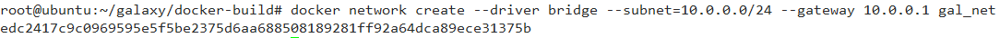

##  galaxy多节点部署操作指南
### 1 引言
&emsp;&emsp;galaxy公链发布了，写这篇文章主要目的是对galaxy公链的多节点部署与运行提供基本的操作指导，包括节点的部署、合约的加载与合约的执行等，使读者能够更好的了解galaxy的特点，熟悉galaxy相关操作。

### 2 节点的部署
#### 2.1 部署前提
&emsp;&emsp;galaxy的运行程序目前是在docker中运行的，因此要部署galaxy需要在环境中部署先安装docker，只有安装了docker才能部署galaxy，至于docker的安装请参考相关的安装说明。

**galaxy的运行环境与最低版本要求**

| 环境要求   | 版本                                 |
| ------ | ------------------------------------------ |
| ubuntu | 18.04 |
| docker | 18.09.7 |

**节点信息**
galaxy多节点以10个节点为例，1个创世节点，7个生产节点和2个同步节点
| 节点名称   |功能| 公钥                                 | 私钥 |
| ------ |------- |------------------------------------------ | --------------- |
| galaxy | 创世节点|GAL6MRyAjQq8ud7hVNYcfnVPJqcVpscN5So8BhtHuGYqET5GDW5CV | 5KQwrPbwdL6PhXujxW37FSSQZ1JiwsST4cqQzDeyXtP79zkvFD3 |
| aprods1 | 生产节点|GAL6BZxjPemrsBRmfCDHf3afvJ4t7JDcNE3UXMudPsE4ezCMUJsWk | 5KexNTtncryJnof5SsKUH2nE9BYdCemsgiNkQQxJnjSG6HaUYVR |
| aprods2 | 生产节点|GAL89Uj4bAVRDwP99VmjcL2Us6TebzsJRTfvbTNo4bmEioMwC2FTV | 5JbFfhtjUkL1RsZsW1MXxzG21pYSJwVQR6UFbvJAEtjwtGtgiAV |
| aprods3 | 生产节点|GAL7Dg55w6aMc1drsQzGWyKz6mfAgQ744nad8cY8cZ3NEGXk97XVG | 5JTF8EmWDVKd7cDfJxny7e154UmjwkL91RnMdson9ZqoFBX4CsC |
| aprods4 | 生产节点|GAL6i58nZEJAwhVHvNKLey5UJi8QYmvdtE6CSKyxSCAmcrw3BdQrX | 5KkTDCWodRGJzKRPpJuAnbUjC8gMeFfwwfzA6hXUA3qxwEiNnG6 |
| aprods5 | 生产节点|GAL84BLRbGbFahNJEpnnJHYCoW9QPbQEk2iHsHGGS6qcVUq9HhutG | 5KAVVPzPZnbAx8dHz6UWVPFDVFtU1P5ncUzwHGQFuTxnEbdHJL4 |
| sprods1 | 生产节点|GAL6YbMDQkoVv6nPEQ4hLiVT9PT2XYKRrkCLq6g9rxhdwbm9D9swp | 5KaZgdzBV4STUWkRzWsAFAFDuXQvBCPW2bkGxj4bkx5cd2uEbJw |
| sprods2 | 生产节点|GAL5KT2TZDvobRot9GvUCM8VtBoKyDoE2LpihUdJUSC2hnq7fPuj3 | 5JkFRF4eCbYTbQ74K8MDpqZiexiBEuyPvhNkg7vS3f9VDXXFzvj |
| sprods3 | 同步节点|GAL5JP2xyiZ4J8JuVprYr7VV5d7V3GhozusDUqJgJSW1sMZkmMMtS | 5JxDmiJfiAUjDtAfu5WRLyoTidmUQytFdWWFPLhQJkJH1xSR85T |
| sprods4 | 同步节点|GAL6xs6kBVLpDfAn97yY9m3j5bZctousUHcgwijA6yD2UeLWjD1dY | 5Jwn7tQWwubHj3vNvAhn3dQH7zohhvpT9V81jbBsFVr2PaPCvwb |

**galaxy的组网**
|节点 | http-server-address | p2p-listen-endpoint  | p2p-server-address | p2p-peer-address |
|-|------------------- | ---------------------| ------------------ | ---------------- |
| 创世节点(galaxy) | 8001 | 9001 | 9001 |
| 生产节点(aprods1)|8002|9002|9002|9001 |
| 生产节点(aprods2)|8003|9003|9003|9001 9002 |
| 生产节点(aprods3)|8004|9004|9004|9001 9002 9003 |
| 生产节点(aprods4)|8005|9005|9005|9001 9002 9003 9004 |
| 生产节点(aprods5)|8006|9006|9006|9001 9002 9003 9004 9005 |
| 生产节点(sprods1)|8007|9007|9007|9001 9002 9003 9004 9005 9006|
| 生产节点(sprods2)|8008|9008|9008|9001 9002 9003 9004 9005 9006 9007 |
| 同步节点(sprods3)|8009|9009|9009|9001 9002 9003 9004 9005 9006 9007 9008 |
| 同步节点(sprods4)|8010|9010|9010|9001 9002 9003 9004 9005 9006 9007 9008 9009 |

#### 2.2加载镜像 
将docker的镜像包galaxy_image.tar.gz，上传到linux系统固定的目录下，通过如下命令将docker镜像导入到环境中
```CQL
docker load -i galaxy_image.tar.gz
```


#### 2.3 手工部署多节点
##### 2.3.1 docker节点部署

创建docker网络名称为gal_net
```CQL
docker network create --driver bridge --subnet=10.0.0.0/24 --gateway 10.0.0.1 gal_net
```


**启动galaxy节点**
```CQL
docker run --name job1 -v /root/galaxy/data/job1:/root/data/job1 -v /root/galaxy/data/logs:/root/data/logs \
    -d -p 8001:8001 -p 9001:9001 --ip 10.0.0.2 --network gal_net -it galaxy:1.0.1 /bin/bash -c \
    "/root/startscript/start_nodgal1.sh"
```


参数说明
| 参数   | 说明                                 |
| ------ | ------------------------------------------ |
|job1 |docker的容器名称 |
|/root/galaxy/data/job1| node数据映射到docker容器外部的路径，用户可以指定自己环境的实际路径|
|/root/data/job1| docker容器内部保存node数据的路径|
|/root/galaxy/data/logs| 合约数据映射到docker容器外部的路径，用户可以指定自己环境的实际路径|
|/root/data/logs| docker容器内部保存合约数据的路径|
|8001:8001| docker端口映射将内部8001端口映射到外部8001端口|
|9001:9001| docker端口映射将内部8001端口映射到外部8001端口|
|10.0.0.2| docker分配的内部IP地址|
|gal_net| docker分配的网络名称|
|galaxy:1.0.1|docker运行使用的镜像|
|/root/startscript/start_nodgal1.sh|docker启动加载的启动脚本|

**启动aprods1节点**
```CQL
docker run --name job2 -v /root/galaxy/data/job2:/root/data/job2 -v /root/galaxy/data/logs:/root/data/logs \
     -d -p 8002:8002 -p 9002:9002 --ip 10.0.0.3 --network gal_net -it galaxy:1.0.1 /bin/bash -c \
     "/root/startscript/start_nodgal2.sh"
```


**启动aprods2节点**
```CQL
docker run --name job3 -v /root/galaxy/data/job3:/root/data/job3 -v /root/galaxy/data/logs:/root/data/logs \
     -d -p 8003:8003 -p 9003:9003 --ip 10.0.0.4 --network gal_net -it galaxy:1.0.1 /bin/bash -c \
     "/root/startscript/start_nodgal3.sh"
```


**启动aprods3节点**
```CQL
docker run --name job4 -v /root/galaxy/data/job4:/root/data/job4 -v /root/galaxy/data/logs:/root/data/logs \
     -d -p 8004:8004 -p 9004:9004 --ip 10.0.0.5 --network gal_net -it galaxy:1.0.1 /bin/bash -c \
     "/root/startscript/start_nodgal4.sh"
```


**启动aprods4节点**
```CQL
docker run --name job5 -v /root/galaxy/data/job5:/root/data/job5 -v /root/galaxy/data/logs:/root/data/logs \
     -d -p 8005:8005 -p 9005:9005 --ip 10.0.0.6 --network gal_net -it galaxy:1.0.1 /bin/bash -c \
     "/root/startscript/start_nodgal5.sh"
```


**启动aprods5节点**
```CQL
docker run --name job6 -v /root/galaxy/data/job6:/root/data/job6 -v /root/galaxy/data/logs:/root/data/logs \
     -d -p 8006:8006 -p 9006:9006 --ip 10.0.0.7 --network gal_net -it galaxy:1.0.1 /bin/bash -c \
     "/root/startscript/start_nodgal6.sh"
```


**启动sprods1节点**
```CQL
docker run --name job7 -v /root/galaxy/data/job7:/root/data/job7 -v /root/galaxy/data/logs:/root/data/logs \
     -d -p 8007:8007 -p 9007:9007 --ip 10.0.0.8 --network gal_net -it galaxy:1.0.1 /bin/bash -c \
     "/root/startscript/start_nodgal7.sh"
```


**启动sprods2节点**
```CQL
docker run --name job8 -v /root/galaxy/data/job8:/root/data/job8 -v /root/galaxy/data/logs:/root/data/logs \
     -d -p 8008:8008 -p 9008:9008 --ip 10.0.0.9 --network gal_net -it galaxy:1.0.1 /bin/bash -c \
     "/root/startscript/start_nodgal8.sh"
```


**启动sprods3节点**
```CQL
docker run --name job9 -v /root/galaxy/data/job9:/root/data/job9 -v /root/galaxy/data/logs:/root/data/logs \
     -d -p 8009:8009 -p 9009:9009 --ip 10.0.0.10 --network gal_net -it galaxy:1.0.1 /bin/bash -c \
     "/root/startscript/start_nodgal9.sh"
```


**启动sprods4节点**
```CQL
docker run --name job10 -v /root/galaxy/data/job10:/root/data/job10 -v /root/galaxy/data/logs:/root/data/logs \
     -d -p 8010:8010 -p 9010:9010 --ip 10.0.0.11 --network gal_net -it galaxy:1.0.1 /bin/bash -c \
     "/root/startscript/start_nodgal10.sh"
```


##### 2.3.2 节点日志查询
通过命令查看node信息
```CQL
docker logs -f job1
```
发现节点已经正常出块


**注意**：docker logs命令在屏幕上持续的打印出块日志，可以通过ctrl+z命令退出

查看节点的出块即交易信息
```CQL
docker logs -f job2 | grep --color=auto "Success to Save block"
```


**启动钱包**
```CQL
docker run \
      --name kgald  -v /root/galaxy/data/galaxy-wallet:/root/galaxy-wallet -d -p 8900:8900 \
      --ip 10.0.0.24 \
      --network gal_net \
      galaxy:1.0.1 /bin/bash -c \
      "./root/kgald/kgald \
      --http-server-address=10.0.0.24:8900 \
      --access-control-allow-origin=* \
      --http-validate-host=false"
```


参数说明
| 参数   | 说明                                 |
| ------ | ------------------------------------------ |
|kgald |docker的容器名称 |
|/root/galaxy/data/galaxy-wallet| 钱包数据映射到docker容器外部的路径，用户可以指定自己环境的实际路径|
|/root/galaxy-wallet| docker容器内部保存钱包数据的路径|
|8900:8900| docker端口映射将内部8900端口映射到外部8900端口|
|10.0.0.24| docker分配的内部IP地址|
|gal_net| docker分配的网络名称|
|galaxy:1.0.1|docker运行使用的镜像|
|/root/kgald/kgald|docker启动加载的启动命令|

##### 2.3.3 命令行配置

创建默认钱包
```CQL
docker exec job1 /root/clgal/clgal --wallet-url http://10.0.0.24:8900 --url http://10.0.0.2:8001 wallet create --to-console
```

从图中可以看到生成的钱包密码为<font color=red>PW5JmTUrrQHrSfm1eUBYgFFShnjngKFdEJWWeeViGAFQhqmwxpzWi</font>，密码钥妥善保管，以便后续解锁钱包使用，如果钱包密码丢失，不能找回。

将节点的公私钥导入钱包
```CQL
docker exec job1 /root/clgal/clgal --wallet-url http://10.0.0.24:8900 --url http://10.0.0.2:8001 wallet import --private-key 5KQwrPbwdL6PhXujxW37FSSQZ1JiwsST4cqQzDeyXtP79zkvFD3
docker exec job1 /root/clgal/clgal --wallet-url http://10.0.0.24:8900 --url http://10.0.0.2:8001 wallet import --private-key 5KexNTtncryJnof5SsKUH2nE9BYdCemsgiNkQQxJnjSG6HaUYVR
docker exec job1 /root/clgal/clgal --wallet-url http://10.0.0.24:8900 --url http://10.0.0.2:8001 wallet import --private-key 5JbFfhtjUkL1RsZsW1MXxzG21pYSJwVQR6UFbvJAEtjwtGtgiAV
docker exec job1 /root/clgal/clgal --wallet-url http://10.0.0.24:8900 --url http://10.0.0.2:8001 wallet import --private-key 5JTF8EmWDVKd7cDfJxny7e154UmjwkL91RnMdson9ZqoFBX4CsC
docker exec job1 /root/clgal/clgal --wallet-url http://10.0.0.24:8900 --url http://10.0.0.2:8001 wallet import --private-key 5KkTDCWodRGJzKRPpJuAnbUjC8gMeFfwwfzA6hXUA3qxwEiNnG6
docker exec job1 /root/clgal/clgal --wallet-url http://10.0.0.24:8900 --url http://10.0.0.2:8001 wallet import --private-key 5KAVVPzPZnbAx8dHz6UWVPFDVFtU1P5ncUzwHGQFuTxnEbdHJL4
docker exec job1 /root/clgal/clgal --wallet-url http://10.0.0.24:8900 --url http://10.0.0.2:8001 wallet import --private-key 5KaZgdzBV4STUWkRzWsAFAFDuXQvBCPW2bkGxj4bkx5cd2uEbJw
docker exec job1 /root/clgal/clgal --wallet-url http://10.0.0.24:8900 --url http://10.0.0.2:8001 wallet import --private-key 5JkFRF4eCbYTbQ74K8MDpqZiexiBEuyPvhNkg7vS3f9VDXXFzvj
docker exec job1 /root/clgal/clgal --wallet-url http://10.0.0.24:8900 --url http://10.0.0.2:8001 wallet import --private-key 5JxDmiJfiAUjDtAfu5WRLyoTidmUQytFdWWFPLhQJkJH1xSR85T
docker exec job1 /root/clgal/clgal --wallet-url http://10.0.0.24:8900 --url http://10.0.0.2:8001 wallet import --private-key 5Jwn7tQWwubHj3vNvAhn3dQH7zohhvpT9V81jbBsFVr2PaPCvwb
```


创建系统账户
系统用户的名称及其作用如下说明：
**galaxy.bpay**:矿工获取出块奖励的临时代管账户，增发GAL的1%的25%会先转到这个账户；
**galaxy.msig**:多重签名管理的账户；
**galaxy.names**:靓号账户拍卖管理的账户；
**galaxy.ram**:内存买卖管理的账户；
**galaxy.rfee**:内存买卖收取手续费的账户，按照每笔交易千分之5的费率收取手续费；
**galaxy.save**:增发galaxy临时存放账户，增发总量5%，其中80%放在此账户，另外20%再分成25%和75%galaxy.bpay和galaxy.vpay；
**galaxy.stake**:cpu、net买卖管理的账户；
**galaxy.token**:发行和管理token的账户；
**galaxy.vpay**:矿工按照获得投票多少比例获取奖励的临时代管账户，增发GAL的1%的75%会先转到这个账户；
**galaxy.bwfee**:收取卖出cpu、net资源手续费账户；

```CQL
docker exec job1 /root/clgal/clgal --wallet-url http://10.0.0.24:8900 --url http://10.0.0.2:8001 create account galaxy galaxy.bpay GAL6MRyAjQq8ud7hVNYcfnVPJqcVpscN5So8BhtHuGYqET5GDW5CV
docker exec job1 /root/clgal/clgal --wallet-url http://10.0.0.24:8900 --url http://10.0.0.2:8001 create account galaxy galaxy.msig GAL6MRyAjQq8ud7hVNYcfnVPJqcVpscN5So8BhtHuGYqET5GDW5CV
docker exec job1 /root/clgal/clgal --wallet-url http://10.0.0.24:8900 --url http://10.0.0.2:8001 create account galaxy galaxy.names GAL6MRyAjQq8ud7hVNYcfnVPJqcVpscN5So8BhtHuGYqET5GDW5CV
docker exec job1 /root/clgal/clgal --wallet-url http://10.0.0.24:8900 --url http://10.0.0.2:8001 create account galaxy galaxy.ram  GAL6MRyAjQq8ud7hVNYcfnVPJqcVpscN5So8BhtHuGYqET5GDW5CV
docker exec job1 /root/clgal/clgal --wallet-url http://10.0.0.24:8900 --url http://10.0.0.2:8001 create account galaxy galaxy.rfee GAL6MRyAjQq8ud7hVNYcfnVPJqcVpscN5So8BhtHuGYqET5GDW5CV
docker exec job1 /root/clgal/clgal --wallet-url http://10.0.0.24:8900 --url http://10.0.0.2:8001 create account galaxy galaxy.save GAL6MRyAjQq8ud7hVNYcfnVPJqcVpscN5So8BhtHuGYqET5GDW5CV
docker exec job1 /root/clgal/clgal --wallet-url http://10.0.0.24:8900 --url http://10.0.0.2:8001 create account galaxy galaxy.stake GAL6MRyAjQq8ud7hVNYcfnVPJqcVpscN5So8BhtHuGYqET5GDW5CV
docker exec job1 /root/clgal/clgal --wallet-url http://10.0.0.24:8900 --url http://10.0.0.2:8001 create account galaxy galaxy.token GAL6MRyAjQq8ud7hVNYcfnVPJqcVpscN5So8BhtHuGYqET5GDW5CV
docker exec job1 /root/clgal/clgal --wallet-url http://10.0.0.24:8900 --url http://10.0.0.2:8001 create account galaxy galaxy.vpay GAL6MRyAjQq8ud7hVNYcfnVPJqcVpscN5So8BhtHuGYqET5GDW5CV
docker exec job1 /root/clgal/clgal --wallet-url http://10.0.0.24:8900 --url http://10.0.0.2:8001 create account galaxy galaxy.bwfee GAL6MRyAjQq8ud7hVNYcfnVPJqcVpscN5So8BhtHuGYqET5GDW5CV
```


加载token合约
```CQL
docker exec job1 /root/clgal/clgal --wallet-url http://10.0.0.24:8900 --url http://10.0.0.2:8001 set contract galaxy.token /root/build/contracts/galaxy.token/ "tokenContract:tcp -h 127.0.0.1  -p 2233  -t 10" -p galaxy.token@active
```


加载多签名合约
```CQL
docker exec job1 /root/clgal/clgal --wallet-url http://10.0.0.24:8900 --url http://10.0.0.2:8001 set contract galaxy.msig /root/build/contracts/galaxy.msig/ "msigContract:tcp -h 127.0.0.1  -p 2244  -t 10" -p galaxy.msig@active
```


创建并发行token
```CQL
docker exec job1 /root/clgal/clgal --wallet-url http://10.0.0.24:8900 --url http://10.0.0.2:8001 push action galaxy.token create '["galaxy", "100000000.0000 SYS"]' -p galaxy.token
```

```CQL
docker exec job1 /root/clgal/clgal --wallet-url http://10.0.0.24:8900 --url http://10.0.0.2:8001 push action galaxy.token issue '["galaxy", "90000000.0000 SYS", "memo"]' -p galaxy
```


加载系统合约
```CQL
docker exec job1 /root/clgal/clgal --wallet-url http://10.0.0.24:8900 --url http://10.0.0.2:8001 set contract galaxy /root/build/contracts/galaxy.system/ "systemContract:tcp -h 127.0.0.1  -p 2255  -t 10" -p galaxy@active
```


设置特殊权限
```CQL
docker exec job1 /root/clgal/clgal --wallet-url http://10.0.0.24:8900 --url http://10.0.0.2:8001 push action galaxy setpriv '["galaxy.msig", 1]' -p galaxy@active
```


创建生产者账户
```CQL
docker exec job1 /root/clgal/clgal --wallet-url http://10.0.0.24:8900 --url http://10.0.0.2:8001 system newaccount galaxy aprods1 GAL6BZxjPemrsBRmfCDHf3afvJ4t7JDcNE3UXMudPsE4ezCMUJsWk --stake-net "1000.0000 SYS" --stake-cpu "1000.0000 SYS" --buy-ram "2000.0000 SYS"
docker exec job1 /root/clgal/clgal --wallet-url http://10.0.0.24:8900 --url http://10.0.0.2:8001 system newaccount galaxy aprods2 GAL89Uj4bAVRDwP99VmjcL2Us6TebzsJRTfvbTNo4bmEioMwC2FTV --stake-net "1000.0000 SYS" --stake-cpu "1000.0000 SYS" --buy-ram "2000.0000 SYS"
docker exec job1 /root/clgal/clgal --wallet-url http://10.0.0.24:8900 --url http://10.0.0.2:8001 system newaccount galaxy aprods3 GAL7Dg55w6aMc1drsQzGWyKz6mfAgQ744nad8cY8cZ3NEGXk97XVG --stake-net "1000.0000 SYS" --stake-cpu "1000.0000 SYS" --buy-ram "2000.0000 SYS"
docker exec job1 /root/clgal/clgal --wallet-url http://10.0.0.24:8900 --url http://10.0.0.2:8001 system newaccount galaxy aprods4 GAL6i58nZEJAwhVHvNKLey5UJi8QYmvdtE6CSKyxSCAmcrw3BdQrX --stake-net "1000.0000 SYS" --stake-cpu "1000.0000 SYS" --buy-ram "2000.0000 SYS"
docker exec job1 /root/clgal/clgal --wallet-url http://10.0.0.24:8900 --url http://10.0.0.2:8001 system newaccount galaxy aprods5 GAL84BLRbGbFahNJEpnnJHYCoW9QPbQEk2iHsHGGS6qcVUq9HhutG --stake-net "1000.0000 SYS" --stake-cpu "1000.0000 SYS" --buy-ram "2000.0000 SYS"
docker exec job1 /root/clgal/clgal --wallet-url http://10.0.0.24:8900 --url http://10.0.0.2:8001 system newaccount galaxy sprods1 GAL6YbMDQkoVv6nPEQ4hLiVT9PT2XYKRrkCLq6g9rxhdwbm9D9swp --stake-net "1000.0000 SYS" --stake-cpu "1000.0000 SYS" --buy-ram "2000.0000 SYS"
docker exec job1 /root/clgal/clgal --wallet-url http://10.0.0.24:8900 --url http://10.0.0.2:8001 system newaccount galaxy sprods2 GAL5KT2TZDvobRot9GvUCM8VtBoKyDoE2LpihUdJUSC2hnq7fPuj3 --stake-net "1000.0000 SYS" --stake-cpu "1000.0000 SYS" --buy-ram "2000.0000 SYS"
docker exec job1 /root/clgal/clgal --wallet-url http://10.0.0.24:8900 --url http://10.0.0.2:8001 system newaccount galaxy sprods3 GAL5JP2xyiZ4J8JuVprYr7VV5d7V3GhozusDUqJgJSW1sMZkmMMtS --stake-net "1000.0000 SYS" --stake-cpu "1000.0000 SYS" --buy-ram "2000.0000 SYS"
docker exec job1 /root/clgal/clgal --wallet-url http://10.0.0.24:8900 --url http://10.0.0.2:8001 system newaccount galaxy sprods4 GAL6xs6kBVLpDfAn97yY9m3j5bZctousUHcgwijA6yD2UeLWjD1dY --stake-net "1000.0000 SYS" --stake-cpu "1000.0000 SYS" --buy-ram "2000.0000 SYS"
```


注册生产者
```CQL
docker exec job1 /root/clgal/clgal --wallet-url http://10.0.0.24:8900 --url http://10.0.0.2:8001 system regproducer aprods1 GAL6BZxjPemrsBRmfCDHf3afvJ4t7JDcNE3UXMudPsE4ezCMUJsWk 10.0.0.3 -p aprods1@active
docker exec job1 /root/clgal/clgal --wallet-url http://10.0.0.24:8900 --url http://10.0.0.2:8001 system regproducer aprods2 GAL89Uj4bAVRDwP99VmjcL2Us6TebzsJRTfvbTNo4bmEioMwC2FTV 10.0.0.4 -p aprods2@active
docker exec job1 /root/clgal/clgal --wallet-url http://10.0.0.24:8900 --url http://10.0.0.2:8001 system regproducer aprods3 GAL7Dg55w6aMc1drsQzGWyKz6mfAgQ744nad8cY8cZ3NEGXk97XVG 10.0.0.5 -p aprods3@active
docker exec job1 /root/clgal/clgal --wallet-url http://10.0.0.24:8900 --url http://10.0.0.2:8001 system regproducer aprods4 GAL6i58nZEJAwhVHvNKLey5UJi8QYmvdtE6CSKyxSCAmcrw3BdQrX 10.0.0.6 -p aprods4@active
docker exec job1 /root/clgal/clgal --wallet-url http://10.0.0.24:8900 --url http://10.0.0.2:8001 system regproducer aprods5 GAL84BLRbGbFahNJEpnnJHYCoW9QPbQEk2iHsHGGS6qcVUq9HhutG 10.0.0.7 -p aprods5@active
docker exec job1 /root/clgal/clgal --wallet-url http://10.0.0.24:8900 --url http://10.0.0.2:8001 system regproducer sprods1 GAL6YbMDQkoVv6nPEQ4hLiVT9PT2XYKRrkCLq6g9rxhdwbm9D9swp 10.0.0.8 -p sprods1@active
docker exec job1 /root/clgal/clgal --wallet-url http://10.0.0.24:8900 --url http://10.0.0.2:8001 system regproducer sprods2 GAL5KT2TZDvobRot9GvUCM8VtBoKyDoE2LpihUdJUSC2hnq7fPuj3 10.0.0.9 -p sprods2@active
docker exec job1 /root/clgal/clgal --wallet-url http://10.0.0.24:8900 --url http://10.0.0.2:8001 system regproducer sprods3 GAL5JP2xyiZ4J8JuVprYr7VV5d7V3GhozusDUqJgJSW1sMZkmMMtS 10.0.0.10 -p sprods3@active
docker exec job1 /root/clgal/clgal --wallet-url http://10.0.0.24:8900 --url http://10.0.0.2:8001 system regproducer sprods4 GAL6xs6kBVLpDfAn97yY9m3j5bZctousUHcgwijA6yD2UeLWjD1dY 10.0.0.11 -p sprods4@active
```


投票生产者
aprods1账户中token达到1500万后进行投票后galaxy会停止出块，主网会自动启动。
```CQL
docker exec job1 /root/clgal/clgal --wallet-url http://10.0.0.24:8900 --url http://10.0.0.2:8001 push action galaxy.token transfer '["galaxy","aprods1","20000000.0000 SYS","vote"]' -p galaxy@active
```

```CQL
docker exec job1 /root/clgal/clgal --wallet-url http://10.0.0.24:8900 --url http://10.0.0.2:8001 system voteproducer prods aprods1 aprods1 aprods2 aprods3 aprods4 aprods5 sprods1 sprods2 -p aprods1@active
```


查看生产者计划
```CQL
docker exec job1 /root/clgal/clgal --wallet-url http://10.0.0.24:8900 --url http://10.0.0.2:8001 get schedule
```


查看投票信息
```CQL
docker exec job1 /root/clgal/clgal --wallet-url http://10.0.0.24:8900 --url http://10.0.0.2:8001 system listproducers
```


过一段时间后就能看到节点轮流产块，创世节点只需同步块
```CQL
docker logs -f job2 | grep --color=auto "Success to Save block"
```


#### 2.4 一键式部署多节点
&emsp;&emsp;由于手工部署步骤过多而且执行命令多，可能会将命令执行错误，因此这里将执行的命令整理成shell脚本，通过执行脚本实现多节点一键式部署。
&emsp;&emsp;首先获取部署脚本deploy_galaxy.sh，将脚本传到需要部署的linux环境的固定目录下，执行命令部署多节点。
```CQL
./deploy_galaxy.sh
```


节点部署完后，查看日志发现生产者轮流出块
```CQL
docker logs -f job2 | grep --color=auto "Success to Save block"
```

